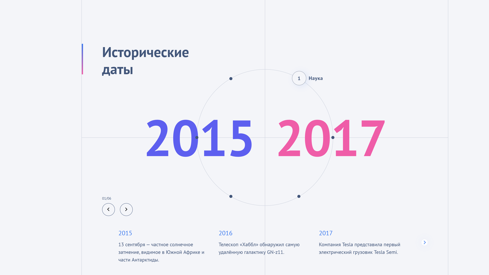
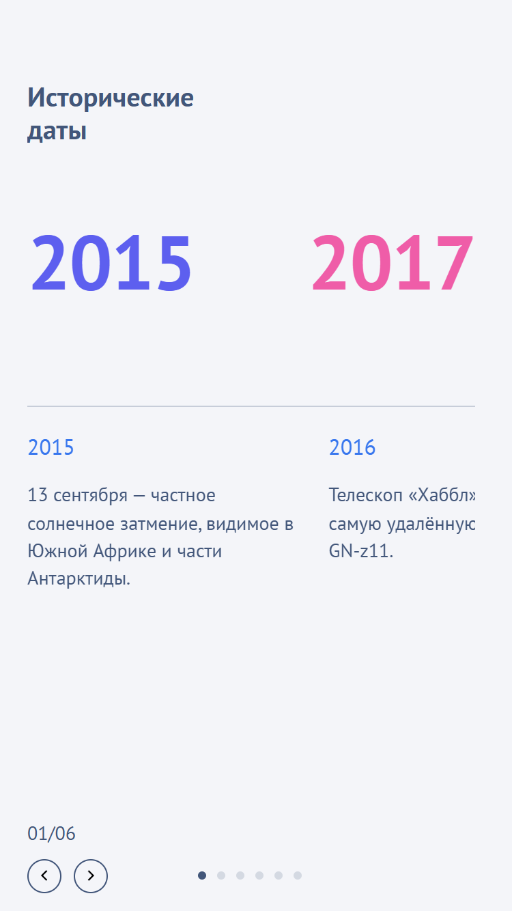

Всё помоги теперь картинки круто вставитть 

# Timeline Widget

Интерактивный блок «Таймлайн» с временными отрезками и слайдером ключевых событий.  
Сделан для тестового задания. Полностью независим: можно рендерить несколько экземпляров на одной странице.

<div align="center">
  <h3>📱 Responsive Timeline Widget</h3>
  <p>Desktop и Mobile версии блока</p>

  <table>
    <tr>
      <td align="center">
        <b>🖥️ Desktop version</b><br/>
        
      </td>
      <td align="center">
        <b>📱 Mobile version</b><br/>
        
      </td>
    </tr>
  </table>
</div>


## ✨ Возможности
- 2–6 временных отрезков, точки на окружности расположены равномерно
- Переключение периода → обновляются числа и ниже показывается соответствующий слайдер событий
- Независимость: несколько таймлайнов на одной странице не конфликтуют
- Плавные анимации (GSAP)
- Слайдер событий на Swiper
- **Готовая мобильная версия**
- Все линии из макета — часть вёрстки (SVG/CSS), не сетка

## 🛠️ Технологии
- **React + TypeScript**
- **SASS/SCSS (modules)**
- **GSAP** для анимаций
- **Swiper** для слайдера
- **Webpack** сборка

## 🚀 Быстрый старт
```bash
# требования: Node 18+
npm install
npm run dev     # дев-сервер
npm run build   # прод сборка в /dist
